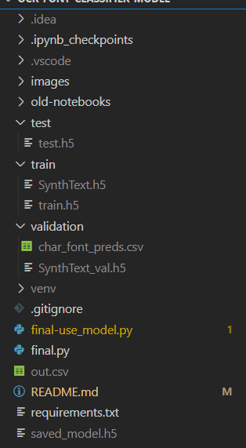

# Requirements

* Python 3 (I used 3.7.9)
* I recommend to use venv but you can also use global pip modules
* Install all requirements in requirements.txt with `pip install -r requirements.txt`
  * Note that if you don't want to use GPU you don't have to install `tensorflow-gpu`
* Download training, validation and test files:
  * train file #1: `SynthText.h5`: https://drive.google.com/file/d/1h5yzTRLFu_1cVkYPOs98RuEPB3Rdc5T-/view
  * train file #2: `train.h5`: https://drive.google.com/file/d/10pRYujKeJ-vtkFY7aaPZVKKAeVR-OuNr/view
  * validation file: `SynthText_val.h5`: 
  * test file: `test.h5`: https://drive.google.com/file/d/1s5QqcBGDk8Bm1WrA00JCQHqaFyCqie4H/view
  
* Put the files in correct folders
  * Put the two training files into folder called `train` inside this project
    * i.e. `train/SynthText.h5`
    * i.e. `train/train.h5`
  * Put the test file into folder called `test` inside this project
    * i.e. `test/test.h5`
  * Put the validation file into folder called `validation` inside the project
    * i.e. `validation/SynthText_val.h5`
  * Example:

